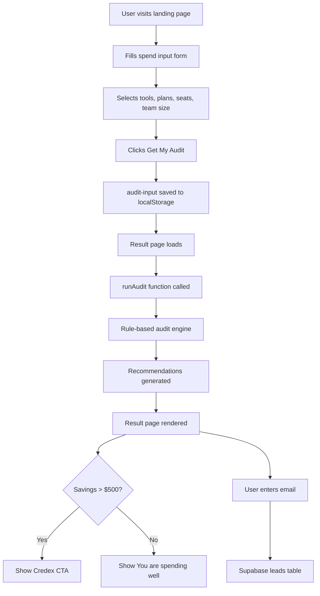

# Architecture

## System Diagram

## Data Flow

1. User fills form on `/audit` page — tool, plan, monthly spend, seats
2. On submit, form data is saved to `localStorage` as JSON
3. User is redirected to `/result/preview`
4. Result page reads from `localStorage`, passes to `runAudit()`
5. `runAudit()` applies rule-based logic for each tool
6. Recommendations returned with savings amounts and reasons
7. Page renders hero savings number + per-tool breakdown
8. User submits email → stored in Supabase `leads` table

## Why I chose this stack

**Next.js 15** — File-based routing, App Router, TypeScript support out of the box. Perfect for a multi-page app with form → result flow.

**TypeScript** — Catches bugs at compile time. With a financial tool, type safety on the audit engine is critical — a wrong number silently passing through would be a trust-killer.

**Tailwind CSS** — Utility-first CSS means no context switching between files. Fast to iterate on UI without naming classes.

**Supabase** — Postgres-backed, free tier, instant REST API. SQL makes it easy for a sales team to query leads by savings amount.

**Vitest** — Zero-config test runner for modern Next.js. All 7 tests run in under 400ms.

**Vercel** — One-click deploy from GitHub. Automatic preview deployments on every push.

## What I would change for 10k audits/day

1. **Move audit to a server action** — Currently runs client-side. At scale, move to Next.js Server Actions so audit logic is not exposed in the browser bundle.

2. **Add Redis caching** — Cache audit results by input hash. Same tool/plan combination should not recompute every time.

3. **Add a job queue** — Email sending should be async via a queue (BullMQ + Redis) so the user gets instant response and email sends in background.

4. **Database indexing** — Add index on `created_at` and `total_monthly_savings` in Supabase for fast sales team queries.

5. **Rate limiting** — Add Upstash Redis rate limiting on the lead capture endpoint to prevent abuse at scale.